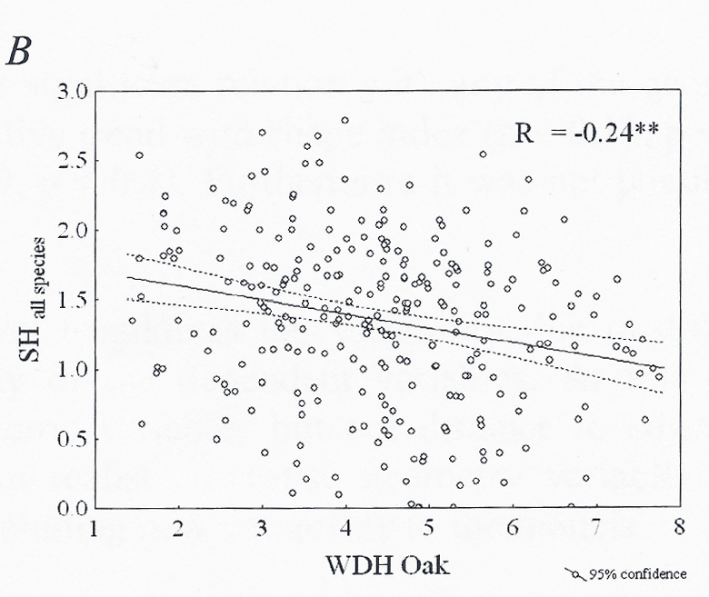
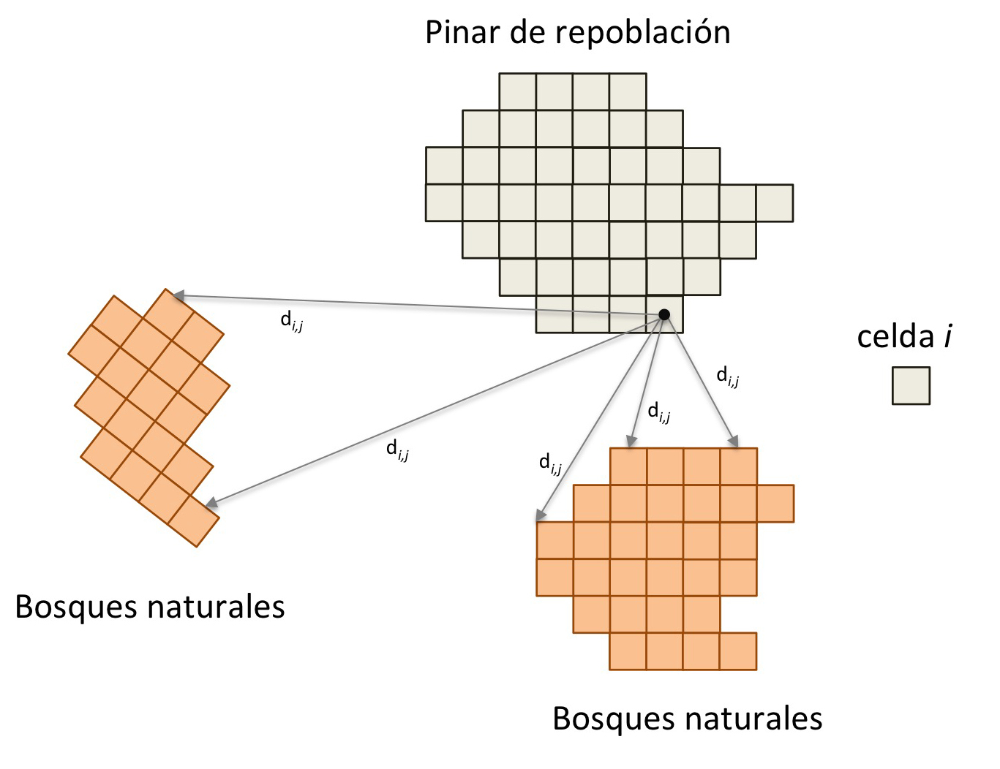

<!-- $theme: default -->
<!-- page_number: true -->

# Crear Landscape
* raster vacío (`value = 0`) *100 x 200* celdas (n=20000)
* `createLandscape()` 	 
--- 
# `createLandscape()` (I) 
* **Pinares de repoblación**
	* Añade patch de pinar en posición fija
	* tamaño variable (**`$size_pp$`**) (300 - 6000)
	* densidad de población (**`$den_pp$`**)
	* `landUse = 1`
* **Bosques naturales**
	* Añade *n* patches (**`$n_nf$`**) (1 - 5)
	* Posición aleatoria 
	* tamaño variable (**`$size_nf$`**) (10 - 500)
	* `landUse = 2`
--- 

# `createLandscape()` (II)
* **Cultivos**
	* Añade entre 3 - 8 patches (*random*) 
	* tamaño 10 - max [7.5 % celdas disponibles]
	* Posición aleatoria
	* `landUse = 3`
* **Otros**
	* Resto celdas
	* `landUse = 0` 
--- 
# Crear Landscape (output)
* Mapa con diferentes patches de pinares de repoblación, cultivos y bosques naturales de acuerdo a lo que el usuario ha elegido. 
* Color de los pinares de repoblación varía en función de la densidad de la repoblación (**`$den_pp$`**) (baja, media, alta). See issue [#5](https://github.com/ajpelu/respine/issues/5) 
--- 

# Valores iniciales de Riqueza
* `initRichness()` 
	* raster con paisaje: output `createLandscape()`
	* dataframe con riqueza por uso del Suelo 
	* raster de distancia
	* densidad del pinar de repoblación
	* Uso del pasado del pinar de repoblación

--- 
# `initRichness()`  (I) 
* **Bosques naturales** (`landUse = 2`)
	* Cada pixel un valor aleatorio del rango de riqueza potencial 
* **Cultivos** (`landUse = 3`)
	* Cada pixel un valor aleatorio del rango de riqueza potencial 

| ecosystem         | low limit | upper limit |
|-------------------|-----------|-------------|
| Repoblaciones     | 12.82     | 13.34       |
| Bosques naturales | 14.67     | 17.88       |
| Cultivos          | 1         | 3           |
Ver issue [#4](https://github.com/ajpelu/respine/issues/4)
	
--- 

# `initRichness()`  (II) 
* **Pine plantations** (`landUse = 1`)

$$ 
Riqueza \sim f\left [w_1 \cdot Density \times w_2 \cdot Distance \times w_3\cdot Reg\right]
$$ 

* Lorena: Tree density strong factor on Richnes and Diversity. A very dense stand structure is also probably a direct obstacle to seed dispersal by wind 
* 
--- 
### tree Density 
$$
ftreeden = \exp \left [ -\frac{1}{2} \left( \frac{ treeDensity - 0.22} {1504.1} \right )^2\right ]
$$

* Eq. 3. Gómez-Aparicio et al. 2009
* treedensity (**`$den_pp$`**)
* baja = 100, media = 1250, alta = 3000 (ver issue [#5](https://github.com/ajpelu/respine/issues/5))

--- 
### Distance to seed source (I)

* En pinares de repoblación, la presencia y abundancia de otras especies diferentes a pinos, está determinada por la distancia a la fuente semillera (entre otras) (González-Moreno et al. 2011)
* De diferentes tipos de vegetación considerados, los bosques naturales de quercíneas son los más influyentes en cuanto a la distancia a la fuente semillera. 
* Distancias mas cortas podrían aumentar el pool de especies en plantaciones (reducir uniformidad) 

--- 
### Distance to seed source (II)
* Ecuación :large_orange_diamond:

$$ 

Diversity = 1.7605 - 0.0932 \left( \sqrt{\sqrt{distance}} \right )

$$

--- 

---
* Diversidad potencial para cada pixel en función de la distancia
* Escalar 0 y 1 
* Esto se aplica solo a celdas de pinar

--- 

### Regenerado de Quercíneas (I)

$$ 
Reg \sim \left (w_1 \cdot Density \times w_2 \cdot Distance \times w_3\cdot Land Use\right)
$$ 

$$ reg \sim 0.2029 \cdot Den. + 0.3204 \cdot Dist. + 0.4767 \cdot landUse$$

* Pesos $\sim$ varianza explicada modelos univariantes según Navarro-González et al. 2013
* Modelo zero+inflado (presencia + abundancia) 
* Usos del suelo la variable mas importante 

(ver issue [#12](https://github.com/ajpelu/respine/issues/12))

---
### Regenerado de Quercíneas (II)
* ¿Cuanto aportan las quercíneas a la riqueza total de especies en los pinares de repoblación? 
* Análisis SINFONEVADA: ¿Cuanto aportan las quercíneas a la riqueza observada en cada plot? (:red_circle: ver viggnetes notas_funcionamiento.Rmd): **9.08%** 
* Ponderar el regenerado un 10 % en la función de la riqueza 
--- 

### Regenerado de Quercíneas (III): Usos del suelo

modelo zero-inflated $\sim$ **prob. no regeneración** + prob. abundancia

| Past Land Use           | odds       | rescaleValue | reverse |
|-------------------------|------------|--------------|---------|
| Oak formation           | 0.3935     | 0.0001       | 0.9999  |
| Mid-mountain Shrubland  | 1.7576     | 0.5018       | 0.4982  |
| Pasture                 | 3.1119     | 0.9999       | 0.0001  |
| Cropland                | 3.0362     | 0.9720       | 0.0279  |

--- 
### (issue [#4](https://github.com/ajpelu/respine/issues/4)) Rango de Valores de riqueza 

| ecosystem         | low limit | upper limit |
|-------------------|-----------|-------------|
| Repoblaciones     | 12.82     | 13.34       |
| Bosques naturales | 14.67     | 17.88       |
| Cultivos          | 1         | 3           |

* Datos obtenidos de Gómez-Aparicio et al. (2009) y SINFONEVADA
* Para bosques naturales (media de encinares y robledales):
	* low: 14.67 [ mean(13.72, 15.62) ] 
	* upp: 17.88 [ mean(16.11, 19.66) ]

---

### (issue[#5](https://github.com/ajpelu/respine/issues/5)) 
Pine density 

| densidad | valor | Gómez-Aparicio et al. 2009 |
|----------|-------|----------------------------|
| baja     | 100   | < 500                      |
| media    | 1250  | 500 - 1500                 |
| alta     | 3000  | > 1500                     |

