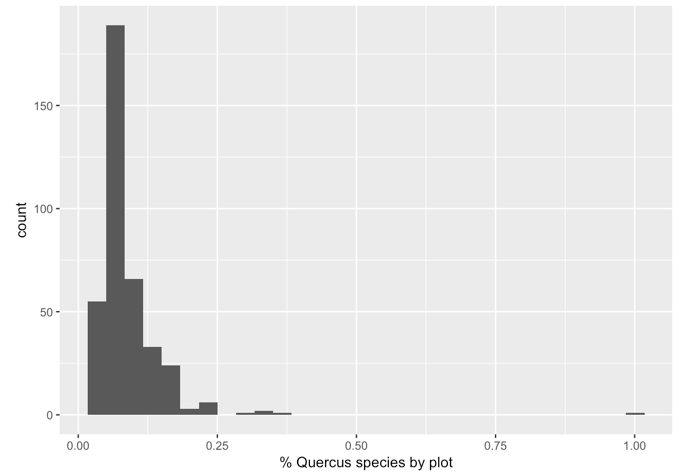

<!-- $theme: default -->
<!-- page_number: true -->

# 1 Crear Landscape
* raster vacío (`value = 0`) *100 x 200* celdas (n=20000)
* `createLandscape()` 	 
--- 
# `createLandscape()` (I) 
* **Pinares de repoblación**
	* Añade patch de pinar en posición fija
	* tamaño variable (**`$size_pp$`**) (300 - 6000)
	* densidad de población (**`$den_pp$`**)
	* `landUse = 1`
* **Bosques naturales**
	* Añade *n* patches (**`$n_nf$`**) (1 - 5)
	* Posición aleatoria 
	* tamaño variable (**`$size_nf$`**) (10 - 500)
	* `landUse = 2`
--- 

# `createLandscape()` (II)
* **Cultivos**
	* Añade entre 3 - 8 patches (*random*) 
	* tamaño 10 - max [7.5 % celdas disponibles]
	* Posición aleatoria
	* `landUse = 3`
* **Otros**
	* Resto celdas
	* `landUse = 0` 
--- 
# `createLandscape()` output
* Mapa con diferentes patches de pinares de repoblación, cultivos y bosques naturales de acuerdo a lo que el usuario ha elegido. 
* Color de los pinares de repoblación varía en función de la densidad de la repoblación (**`$den_pp$`**) (baja, media, alta). See issue [#5](https://github.com/ajpelu/respine/issues/5) 
--- 

# 2 Valores iniciales de Riqueza
* `initRichness()` 
	* raster con paisaje: output `createLandscape()`
	* dataframe con riqueza por uso del Suelo 
	* raster de distancia
	* densidad del pinar de repoblación
	* Uso del pasado del pinar de repoblación

--- 
# `initRichness()`  (I) 
* **Bosques naturales** (`landUse = 2`)
	* Cada pixel un valor aleatorio del rango de **riqueza potencial** 
* **Cultivos** (`landUse = 3`)
	* Cada pixel un valor aleatorio del rango de **riqueza potencial**  

| ecosystem         | low limit | upper limit |
|-------------------|-----------|-------------|
| Repoblaciones     | 12.82     | 13.34       |
| Bosques naturales | 14.67     | 17.88       |
| Cultivos          | 1         | 3           |
Ver issue [#4](https://github.com/ajpelu/respine/issues/4)
	
--- 

# `initRichness()`  (II) 
* **Pine plantations** (`landUse = 1`)

$$ 
Riqueza \sim RiquezaPotencial \times fc
$$ 

$$ 
fc\sim f\left [w_1 \cdot Reg \times w_2 \cdot DistSeedSource \times w_3\cdot TreeDensity\right]
$$ 

pesos?

--- 
### tree Density 

$$
ftreeden = \exp \left [ -\frac{1}{2} \left( \frac{ treeDensity - 0.22} {1504.1} \right )^2\right ]
$$

* Eq. 3. Gómez-Aparicio et al. 2009
* treedensity (**`$den_pp$`**)
* baja = 100, media = 1250, alta = 3000 (ver issue [#5](https://github.com/ajpelu/respine/issues/5))

---
### Regenerado de Quercíneas (I) (contribución a Riqueza)
* ¿Cuanto aportan las quercíneas a la riqueza total de especies en los pinares de repoblación? 
* DataPaper **SINFONEVADA**. ¿Cuanto aportan las quercíneas a la riqueza observada en cada plot?
* Aportan un **9 %** (promedio) a la riqueza de la parcela (**$w_1 \sim 0.1$**)

--- 
### Regenerado de Quercíneas (II) (elección variables)

$$ 
Reg\sim f\left [\bold{UsoSuelo} \times DistSeedSource \times TreeDensity\right]
$$ 

* Pesos $\sim$ varianza explicada modelos univariantes 

| variable  | Pseudo-R2 | scale |
|-----------------------------------------|-----------|--------------------------|
| past Land Use                           | 0.1238    | 0.4767                   |
| Propagule source distance               | 0.0832    | 0.3204                   |
| Pine density                            | 0.0057    | 0.2029                   |

* Uso Suelo vs. modelo: 
	* Ver issue [#12](https://github.com/ajpelu/respine/issues/12)
	* Correlación variables, inflacción varianca (VIF) 

---
### Regenerado de Quercíneas(III): Usos del suelo

modelo zero-inflated $\sim$ **prob. no regeneración** + prob. abundancia

	
| Past Land Use           | odds Ratio | rescale | reverse Rescale  |
|-------------------------|------------|--------------|-----------------------|
| Oak formation           | 0.3935     | 0.0001       | 0.9999                |
| Mid-mountain Shrubland  | 1.7576     | 0.5018       | 0.4982                |
| Pasture                 | 3.1119     | 0.9999       | 0.0001                |
| Cropland                | 3.0362     | 0.9720       | 0.0279                |	 
* Nota: Valores para misma distancia y densidad media (750 tree/ha) 

---
### Regenerado de Quercíneas (IV): Usos del suelo
$$ 
w_1 \cdot Reg = 0.1 \times uso
$$ 

* **probabilidad reescalada de encontrar regeneración** en función del uso del suelo sigue el siguiente gradiente: 

> *Encinar (0.9999)  
Matorrales (0.4982)
Cultivos (0.0279) 
Pastizales (0.0001)*

---
### Distance to seed source (I)

* En pinares de repoblación, la presencia y abundancia de otras especies diferentes a pinos, está determinada por la distancia a la fuente semillera (entre otras) (González-Moreno et al. 2011)
* De diferentes tipos de vegetación considerados, los bosques naturales de quercíneas son los más influyentes en cuanto a la distancia a la fuente semillera. 
* Distancias mas cortas podrían aumentar el pool de especies en plantaciones (reducir uniformidad) 

--- 
### Distance to seed source (II)
* Ecuación :large_orange_diamond:

$$ 

Diversity = 1.7605 - 0.0932 \left( \sqrt{\sqrt{distance}} \right )

$$

--- 

---
* Diversidad potencial para cada pixel en función de la distancia
* Escalar 0 y 1 
* Esto se aplica solo a celdas de pinar

--- 
# Dispersal module 

*sensu* Nathan et al. 2012

* Start-point (fuente semillera)
* Disperser 
* End-point (target)

--- 

## Seed source (I): Cualitativo

A > diversidad fuente semillera > diversidad semillas 

* Aprox. la mitad de especies leñosas de fruto carnoso en el área de estudio son dispersadas por mamíferos (Matías et al. 2010) y/o aves (Zamora et al. 2010; Mendoza et al. 2009)

* ¿Cuantas especies pueden dispersar? 
	* Mendoza et al. 2009 = 20 especies fruto carnoso en el área de estudio
	* Gómez-Aparicio et al. 2009 riqueza potencial carnosas encinares 1.39 (1.07 - 1.77) y en robledales 3.80 (2.96 - 4.75)  

issue [#13](https://github.com/ajpelu/respine/issues/13)

--- 

## Disperser (I)

* Tipos de dispersores
	* Small birds
	* Medium birds
	* Mammals   
* Cantidad de dispersores 
	* No excluyentes
	* Usuario define porcentaje de cada uno 

--- 
## Disperser (II): Distancias y kernels de dispersion 
* Small birds [@Jordano2007 @Zamora2010]: 
    * raramente pasan de 100 m (rango 0 - 100)
    * El 50 % de las semillas son dispersadas en los primeros 51 m 

* Medium birds:
    * El 50 % de las semillas son dispersadas mas allá de los 110 m
  
* Mammals [@Jordano2007 @Matias2010]
    * rango 0 hasta > 1500 m
    * El 50 % de las semillas son dispersadas mas allá de los 495 m
    * Pico de dispersión entre 650 - 700 m

* Arrendajo [@Gomez2003 @Pons2007]
    * rango 5 - 1000 [@Gomez2003]; 3 - 550 [@Pons2007]
    * Pico de dispersión en función del tipo de parche destino. General a 262 m, repoblaciones a 402 m [@Gomez2003]
    * Muy dependiente del paisaje 

--- 
### (issue [#4](https://github.com/ajpelu/respine/issues/4)) Rango de Valores de riqueza 

| ecosystem         | low limit | upper limit |
|-------------------|-----------|-------------|
| Repoblaciones     | 12.82     | 13.34       |
| Bosques naturales | 14.67     | 17.88       |
| Cultivos          | 1         | 3           |

* Datos obtenidos de Gómez-Aparicio et al. (2009) y SINFONEVADA
* Para bosques naturales (media de encinares y robledales):
	* low: 14.67 [ mean(13.72, 15.62) ] 
	* upp: 17.88 [ mean(16.11, 19.66) ]

---

### (issue[#5](https://github.com/ajpelu/respine/issues/5)) 
Pine density 

| densidad | valor | Gómez-Aparicio et al. 2009 |
|----------|-------|----------------------------|
| baja     | 100   | < 500                      |
| media    | 1250  | 500 - 1500                 |
| alta     | 3000  | > 1500                     |

