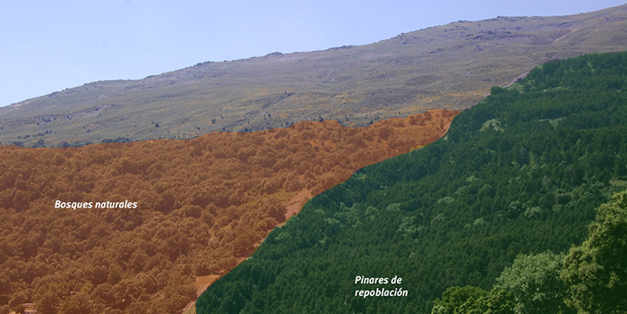

Según varios estudios científicos la riqueza de especies que se encuentran bajo los pinares de repoblación aumentan al aumentar el número de manchas de bosques naturales cercanos al pinar de repoblación, así como cuanto mayor sea el tamaño de dichas manchas.

### Tamaño

Se refiere al tamaño de las manchas de bosques naturales (Robledales, Encinares) existentes alrededor de una mancha de pinar repoblación.

### Número de manchas de bosques naturales

Se refiere al número parches de bosques naturales existentes cercanos al pinar de repoblación.

