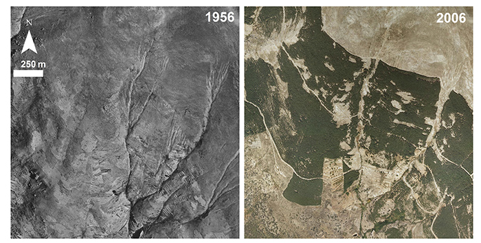

### Uso del suelo en el pasado

Los pinares de repoblación se plantaron entre 1930 y 1980 para minimizar la pérdida de suelo en área deforestadas. Estas repoblaciones se realizaron sobre áreas que habían sufrido un alto impacto antrópico: generalmente manchas de vegetación natural que se quemaban, desbrozaban, talaban, etc. para ser convertidas en cultivos o en áreas para ganado.

La riqueza de especies que observamos en la actualidad bajo los pinares de repoblación está condicionada en parte por el uso del suelo que tuvo el área repoblada en el pasado.

