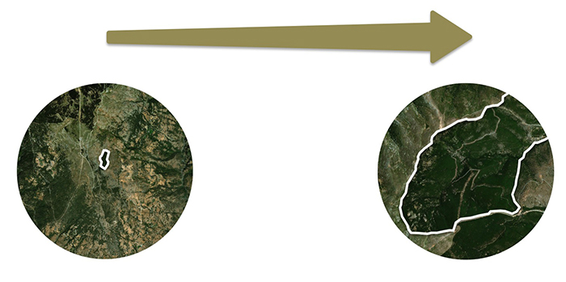
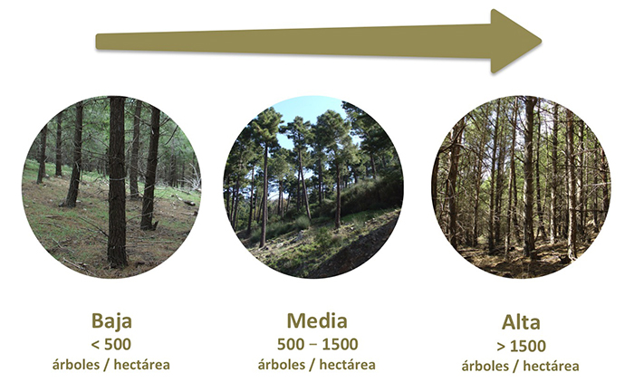

### Tamaño de la repoblación

El tamaño de la repoblación de pinares inluyen la diversidad de especies que puede albergar.

### Densidad de la repoblación
Se refiere al número de árboles por hectárea. Varios trabajos han demostrado que diferente densidad arbórea afectan a la riqueza de especies que podemos encontrar bajo los pinares de repoblación.

